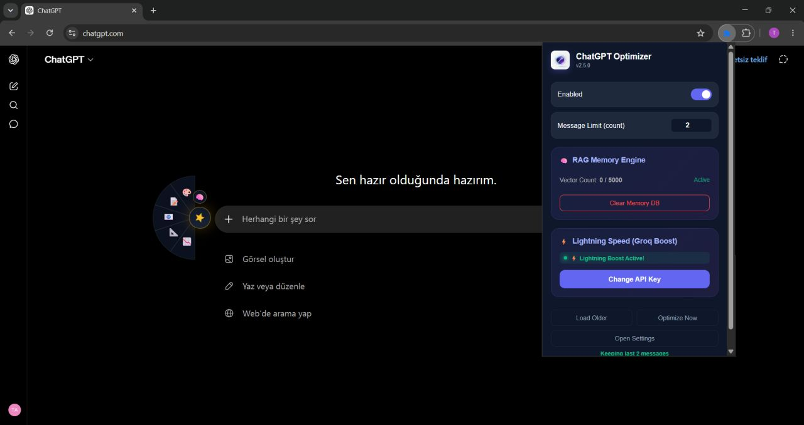
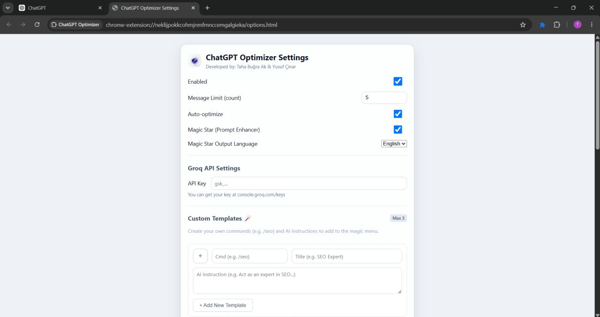

<div align="center">

# 🧠 ContextOps (ChatGPT Optimizer)

**The Ultimate Productivity & Performance Extension for ChatGPT**

[](#)
[](LICENSE)
[](CONTRIBUTING.md)

ContextOps is a source-available Chrome MV3 extension designed to keep ChatGPT lightning-fast during long conversations. It intercepts network requests to accelerate the UI (Auto-Trim), remembers the past with a local RAG memory engine, and automates your workflow with custom templates.

[Installation](#-installation) • [Features](#-core-features) • [How It Works](#-the-problem--solution) • [Contributing](#-contributing)

</div>

---

## 🚀 The Problem & Solution

When having deep conversations with ChatGPT (especially those spanning hundreds of messages), the browser interface can become extremely sluggish, lag during scrolling, and consume heavy system resources due to the massive amount of DOM elements being processed.

**ContextOps solves this problem** by catching network requests directly at the `fetch` layer (on the `MAIN World`). It safely "trims" the incoming chat payload before it is processed and rendered by React. By keeping only the most recent messages active, it **completely eliminates lag** while ensuring your entire chat history remains safely stored on OpenAI's servers.

> **TL;DR:** No more ChatGPT lag or freezes; plus, you get a 100% local, in-browser memory (RAG) and smart shortcuts!

---

## ✨ Core Features

### 1. ⚡ Smart Auto-Trim Engine
Optimizes the chat payload invisibly before it is processed by React, ensuring ChatGPT remains as fast and responsive as day one, regardless of how long the conversation gets. You can load the full history at any time or focus only on the latest messages.
<p align="center">
  
</p>

### 2. 🧠 Local RAG (Memory) Engine
Grants ChatGPT a persistent memory across conversations without relying on external servers or databases. It generates embeddings in-browser using `@xenova/transformers` via the Chrome Offscreen API and stores them in IndexedDB using `@orama/orama`. It seamlessly searches for critical context and prepends historical data to your prompts when needed.

<p align="center">
  
</p>

### 3. 🪄 Custom Command Templates & Prompt Optimization
Speed up your workflow with personalized, instantly expanding command templates (e.g., `/cot`, `/feynman`, `/spec`). Additionally, using the "Magic Sphere" interface, it instantly transforms your short texts into highly detailed and professional prompts (utilizing the Groq API or UI automation).

---

## 🔒 Privacy First

ContextOps is built with a strict **local-first** philosophy.

- ✅ **Fully Local:** All processing, JSON trimming, vector extraction, and RAG memory storage happen directly within your browser (client-side).
- ❌ **No Data Collection:** We do not collect, store on our servers, or transmit your conversations or API keys.
- ❌ **No Telemetry:** Zero external analytics or tracking scripts.

---

## 🛠️ Tech Stack

- **Architecture:** Vite + Vanilla JS (Chrome MV3, Main World Injection, Service Workers, and Offscreen Document API).
- **Search & Vector Database:** IndexedDB-backed [@orama/orama](https://github.com/oramasearch/orama) for fast, in-browser text/vector search.
- **AI (Embeddings):** [@xenova/transformers](https://github.com/xenova/transformers.js) (`Xenova/all-MiniLM-L6-v2` model) to run local embeddings directly in the browser.
- **Testing:** Jest and JSDOM.

---

## 📦 Installation (Developer Mode)

Because `node_modules` and the compiled production build are **not** included in the repository, you will need Node.js installed on your system to build the extension from the source code.

### Prerequisites
- **Node.js** (v18 or higher recommended)
- **npm** or **yarn**

### Build Steps
1. **Clone the repository:**
   ```bash
   git clone https://github.com/TahaBugra1/ContextOps.git
   cd ContextOps
   ```
2. **Install dependencies:**
   ```bash
   npm install
   ```
3. **Build the extension:**
   ```bash
   npm run build
   ```
   *(This will compile the assets using Vite and generate a `dist` folder.)*

### Load in Chrome
4. Open Chrome and type `chrome://extensions/` in the address bar.
5. Toggle **Developer mode** ON (top right corner).
6. Click the **Load unpacked** button and select the newly created **`dist`** folder inside the project.
7. Open [ChatGPT](https://chatgpt.com) — ContextOps will automatically integrate into the interface and activate!

---

## 👨‍💻 Development

If you want to actively develop on the source code and test changes:
```bash
npm run dev
```
This command watches for file changes and automatically rebuilds the extension in the background. (Note: To apply JS/HTML changes, you may need to refresh the extension on the `chrome://extensions/` page or refresh the ChatGPT page).

---

## 🤝 Contributing

Contributions are what make the developer community such an amazing place to learn, inspire, and create. Any contributions you make (bug fixes, new features, documentation updates) are **greatly appreciated**.

Please review our [CONTRIBUTING.md](CONTRIBUTING.md) file for details on our development standards, code structure, and testing guidelines.

## 📜 License

This project is source-available for personal and educational use.

Commercial use, redistribution, publication of modified versions,
and derivative works require prior written permission.

See the [LICENSE](LICENSE) file for full terms.

<div align="center">
  <i>Built with ❤️ for power users and AI enthusiasts.</i>
</div>
